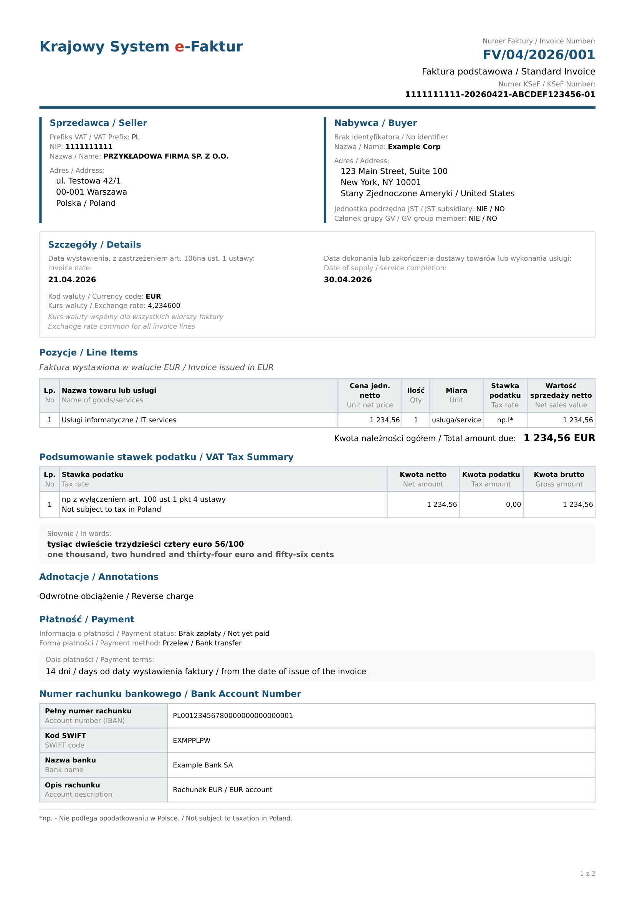

# KSeF PDF — Bilingual Invoice PDF Generator

Generates bilingual (Polish/English) PDF visualizations from KSeF FA(3) XML invoices, compliant with the official KSeF format. Includes QR verification codes per the [official KSeF QR specification](https://github.com/CIRFMF/ksef-docs/blob/main/kody-qr.md).

**[Download example PDF](docs/example_invoice.pdf)**



## Features

- Bilingual PL/EN labels throughout (header, seller/buyer, details, line items, VAT summary, payment, QR section)
- QR code with SHA-256 verification URL per KSeF spec (KOD I)
- Amount in words (Polish + English) with proper currency declension
- Tax rate footnotes (np.I*, zw.*, oo.*)
- Compact A4 layout — invoice data on page 1, QR verification on page 2
- Two modes: HTTP API (Docker) and CLI

## Quick Start

### CLI

```bash
pip install -e .
python -m app.generate invoice.xml -o invoice.pdf
```

The XML filename must be the KSeF number (e.g. `1111111111-20260421-ABCDEF123456-01.xml`) — this is how the KSeF number is extracted and displayed on the PDF.

### HTTP API (Docker)

```bash
docker compose up -d

curl -X POST http://localhost:8000/generate \
  -F "file=@1111111111-20260421-ABCDEF123456-01.xml" \
  --output invoice.pdf

curl http://localhost:8000/health
```

## Tech Stack

- **Python 3.12+**
- **FastAPI** — HTTP API
- **WeasyPrint** — HTML/CSS to PDF
- **Jinja2** — HTML templating
- **qrcode** — QR code generation
- **num2words** — amount-to-words conversion (PL + EN)

## Project Structure

```
ksef-pdf/
├── app/
│   ├── main.py          # FastAPI (POST /generate, GET /health)
│   ├── generate.py      # CLI entry point
│   ├── parser.py        # KSeF XML → InvoiceData dataclasses
│   ├── models.py        # Dataclass definitions
│   ├── render.py        # Jinja2 + WeasyPrint → PDF
│   ├── qr.py            # QR code (SHA-256 → Base64URL → URL → PNG)
│   ├── num_words.py     # Amount to bilingual words
│   ├── mappings.py      # Lookup tables (countries, tax rates, etc.)
│   └── formatting.py    # Number formatting (Polish style)
├── templates/
│   ├── invoice.html     # Jinja2 template
│   └── styles.css       # Print CSS (A4)
├── tests/
├── Dockerfile
├── docker-compose.yml
└── pyproject.toml
```

## Supported Schema

- **FA(3)** — namespace `http://crd.gov.pl/wzor/2025/06/25/13775/`
- Invoice types: VAT, KOR, ZAL, ROZ, UPR
- QR: KOD I (verification) only

## Tests

```bash
pip install -e ".[dev]"
pytest
```

## Credits

This project was inspired by and references:

- [CIRFMF/ksef-pdf-generator](https://github.com/CIRFMF/ksef-pdf-generator) (MIT) — reference TypeScript KSeF PDF generator
- [CIRFMF/ksef-docs](https://github.com/CIRFMF/ksef-docs) (MIT) — official KSeF documentation, including QR code specification

## License

MIT
